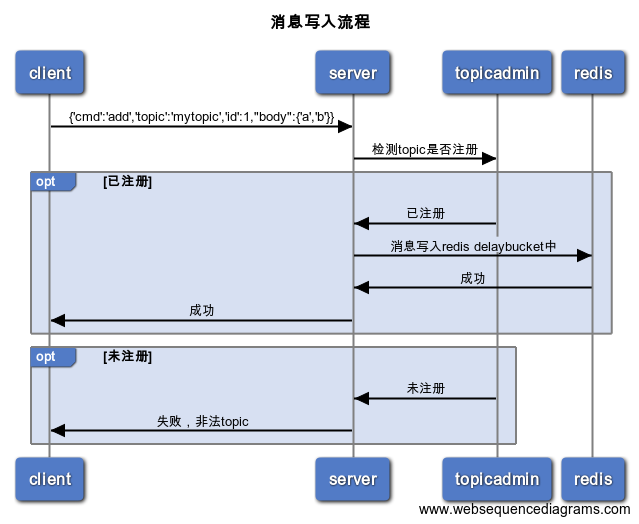
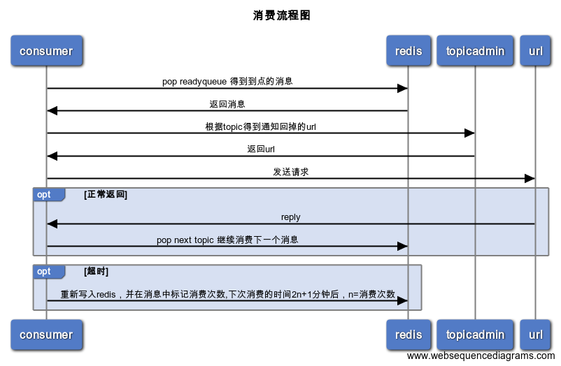
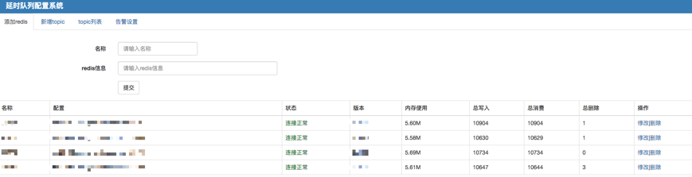
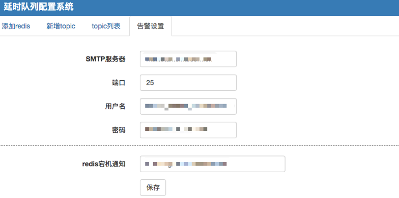
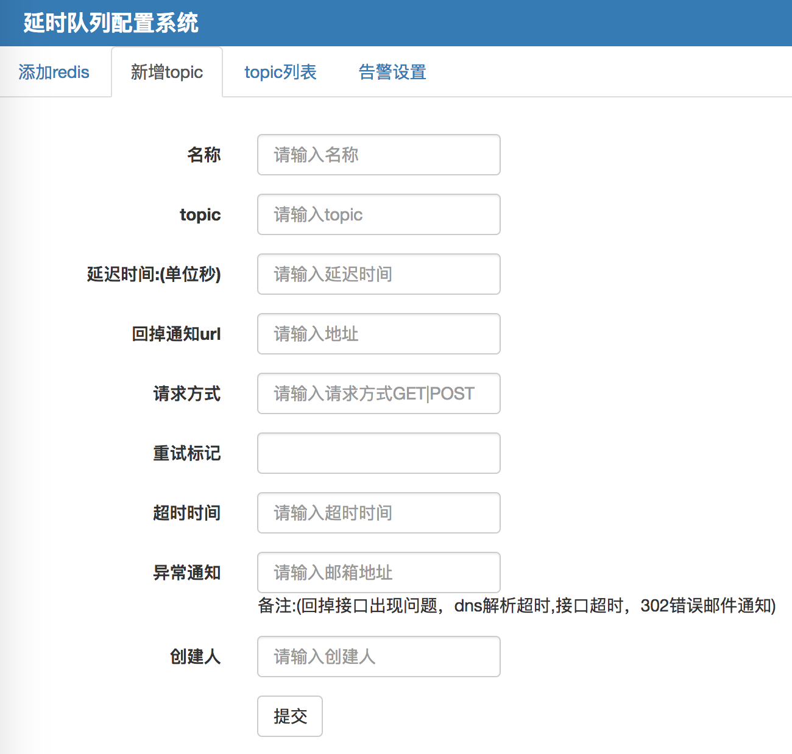
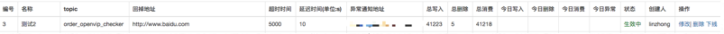
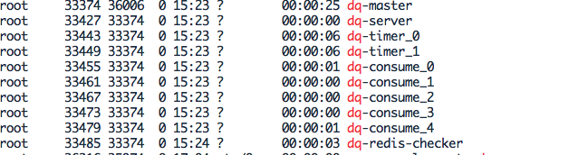
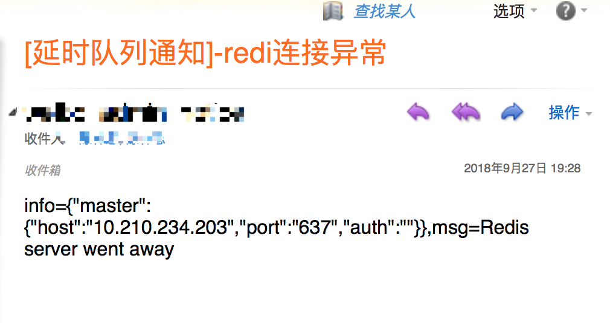

延迟队列，顾名思义它是一种带有延迟功能的消息队列。 那么，是在什么场景下我才需要这样的队列呢？

### 一、背景
先看看一下业务场景：
* 1.会员过期前3天发送召回通知
* 2.订单支付成功后，5分钟后检测下游环节是否都正常，比如用户购买会员后，各种会员状态是否都设置成功
* 3.如何定期检查处于退款状态的订单是否已经退款成功？
* 4.实现通知失败，1，3，5，7分钟重复通知，直到对方回复？


通常解决以上问题，最简单直接的办法就是定时去扫表。

扫表存在的问题是：

* 1.扫表与数据库长时间连接，在数量量大的情况容易出现连接异常中断，需要更多的异常处理，对程序健壮性要求高
* 2.在数据量大的情况下延时较高，规定内处理不完，影响业务，虽然可以启动多个进程来处理，这样会带来额外的维护成本，不能从根本上解决。
* 3.每个业务都要维护一个自己的扫表逻辑。 当业务越来越多时，发现扫表部分的逻辑会重复开发，但是非常类似

延时队列能对于上述需求能很好的解决

### 二、调研
调研了市场上一些开源的方案，以下：
* 1.有赞科技：只有原理，没有开源代码
* 2.github个人的：https://github.com/ouqiang/delay-queue

      1.基于redis实现，redis只能配置一个,如果redis挂了整个服务不可用，可用性差点
      2.消费端实现的是拉模式，接入成本大，每个项目都得去实现一遍接入代码
      3.在star使用的人数不多，放在生产环境，存在风险，加之对go语言不了解，出了问题难以维护

* 3.SchedulerX-阿里开源的： 功能很强大，但是运维复杂，依赖组件多，不够轻量
* 4.RabbitMQ-延时任务:  本身没有延时功能，需要借助一特性自己实现，而且公司没有部署这个队列，去单独部署一个这个来做延时队列成本有点高，而且还需要专门的运维来维护，目前团队不支持

基本以上原因打算自己写一个，平常使用php多，项目基本redis的zset结构作为存储，用php语言实现 ，实现原理参考了有赞团队：https://tech.youzan.com/queuing_delay/

整个延迟队列主要由4个部分

  * JobPool用来存放所有Job的元信息。
  * DelayBucket是一组以时间为维度的有序队列，用来存放所有需要延迟的Job（这里只存放Job Id）。
  * Timer负责实时扫描各个Bucket，并将delay时间大于等于当前时间的Job放入到对应的Ready Queue。
  * ReadyQueue存放处于Ready状态的Job（这里只存放JobId），以供消费程序消费。


消息结构
每个Job必须包含一下几个属性：

  1. topic：Job类型。可以理解成具体的业务名称。
  2. id：Job的唯一标识。用来检索和删除指定的Job信息。
  3. delayTime：jod延迟执行的时间，13位时间戳
  4. ttr（time-to-run)：Job执行超时时间。
  5. body：Job的内容，供消费者做具体的业务处理，以json格式存储。


对于同一类的topic delaytime,ttr一般是固定，job可以在精简一下属性

  1.topic：Job类型。可以理解成具体的业务名称
  
  2.id：Job的唯一标识。用来检索和删除指定的Job信息。
  
  3.body：Job的内容，供消费者做具体的业务处理，以json格式存储。

delaytime,ttr在topicadmin后台配置


### 三、目标

* 轻量级：有较少的php的拓展就能直接运行，不需要引入网络框架，比如swoole，workman之类的
* 稳定性：采用master-work架构，master不做业务处理，只负责管理子进程，子进程异常退出时自动拉起
* 可用性：
     * 1.支持多实例部署，每个实例无状态，一个实例挂掉不影响服务
     * 2.支持配置多个redis，一个redis挂了只影响部分消息
     * 3.业务方接入方便，在后台只需填写相关消息类型和回调接口
* 拓展性:  当消费进程存在瓶颈时，可以配置加大消费进程数，当写入存在瓶颈时，可增加实例数写入性能可线性提高
* 实时性：允许存在一定的时间误差。
* 支持消息删除：业务使用方，可以随时删除指定消息。
* 消息传输可靠性：消息进入到延迟队列后，保证至少被消费一次。
* 写入性能：qps>1000+

#### 四、架构设计与说明

总体架构

采用master-work架构模式，主要包括6个模块：

* 1.dq-mster:  主进程，负责管理子进程的创建，销毁，回收以及信号通知
* 2.dq-server: 负责消息写入，读取，删除功能以及维护redis连接池
* 3.dq-timer-N: 负责从redis的zset结构中扫描到期的消息，并负责写入ready 队列，个数可配置，一般2个就行了，因为消息在zset结构是按时间有序的
* 4.dq-consume-N: 负责从ready队列中读取消息并通知给对应回调接口，个数可配置
* 5.dq-redis-checker: 负责检查redis的服务状态，如果redis宕机，发送告警邮件
* 6.dq-http-server: 提供web后台界面，用于注册topic

### 五、模块流程图
消息写入:



timer查找到期消息:


consumer消费流程:



#### 六、部署

环境依赖：`PHP 5.5+  安装sockets，redis，pcntl,pdo_mysql 拓展`  

ps: 熟悉docker的同学可以直接用镜像: shareclz/php7.2.14 里面包含了所需拓展

##### step1:安装数据库用于存储一些topic以及告警信息
执行:

> mysql> source dq.sql


##### step2:在DqConfg.文件中配置数据库信息： DqConf::$db

##### step3: 启动http服务
在DqConf.php文件中修改php了路径 $phpBin

命令：
> php DqHttpServer.php --port 8088

访问:http://127.0.0.1:8088,出现配置界面


redis信息格式：host:port:auth 比如 127.0.0.1:6379:12345


##### stop4:配置告信息(比如redis宕机)



##### stop5:注册topic


重试标记说明:

    1.接口返回为空默认重试
    2.满足指定返回表达会重试，res表示返回的json数组，比如:
    回调接口返回json串：{"code":200,"data":{"status":2,"msg":"返回失败"}}，重试条件可以这样写
        {res.code}!=200 
        {res.code}!=200 && {res.data.status}!=2 
        {res.code}==200 && {res.data.status}==2 || {res.data.msg}=='返回失败'



##### step6:启动服务进程:   

> php DqInit.php --port 6789 &


执行 ps -ef | grep dq 看到如下信息说明启动成功



##### step7: 写入数据，参考demo.php 

##### step8:查看日志
默认日志目录在项目目录的logs目录下，在DqConf.php修改$logPath

* 1.请求日志：request_ymd.txt
* 2.通知日志：notify_ymd.txt 
* 3.错误日志：err_ymd.txt

##### step9:如果配置文件有改动

* 1.系统会自动检测配置文件新，如果有改动，会自动退出(没有找到较好的热更新的方案)，需要重启，可以在crontab里面建个任务,1分钟执行一次，程序有check_self的判断
* 2.优雅退出命令:  master检测侦听了USR2信号，收到信号后会通知所有子进程，子进程完成当前任务后会自动退出

> ps -ef | grep dq-master| grep -v grep | head -n 1 | awk '{print $2}' | xargs kill -USR2


### 七、性能测试
需要安装pthreads拓展：

测试原理：使用多线程模拟并发，在1s内能成功返回请求成功的个数

```
php DqBench  concurrency  requests
concurrency:并发数
requests： 每个并发产生的请求数

测试环境：内存 8G ，8核cpu，2个redis和1个dq-server 部署在一个机器上，数据包64字节
qps：2400
```

### 八、值得一提的性能优化点：

* 1.redis multi命令：将多个对redis的操作打包成一个减少网络开销
* 2.计数的操作异步处理，在异步逻辑里面用函数的static变量来保存，当写入redis成功后释放static变量，可以在redis出现异常时计数仍能保持一致，除非进程退出
* 3.内存泄露检测有必要:  所有的内存分配在底层都是调用了brk或者mmap，只要程序只有大量brk或者mmap的系统调用，内存泄露可能性非常高 ,检测命令: strace -c -p pid | grep -P 'mmap| brk'
* 4.检测程序的系统调用情况：strace -c -p pid  ，发现某个系统函数调用是其他的数倍，可能大概率程序存在问题

### 九、异常处理

1.如果调用通知接口在超时时间内，没有收到回复认为通知失败，系统会重新把数据放入队列，重新通知，系统默认最大通知10次(可以在Dqconf.php文件中修改$notify_exp_nums)通知间隔为2n+1，比如第一次1分钟，通知失败，第二次3分钟后，直到收到回复，超出最大通知次数后系统自动丢弃，同时发邮件通知


2.线上redis每隔1s持久化一次，存在丢失1s数据的情况，出现这种情况可以对比request_ymd.txt和notify_ymd.txt日志手动恢复过来

3.redis宕机通知:



`ps:网络抖动在所难免，通知接口如果涉及到核心的服务,一定要保证幂等！！`

### 十、线上情况

线上部署了两个实例每个机房部一个，4个redis共16G内存作存储，服务稳定运行数月，各项指标均符合预期

主要接入业务:

* 订单10分钟召回通知
* 调用接口超时或者失败时做补偿
* 会员过期前3天召回通知

### 十一、不足与展望


1.由于团队使用的镜像缺少libevent拓展，所以dq-server基于select模型，并发高的场景下性能存在瓶颈，后续可以改为基于libevent事件模型，提升并发性能

2.timer和consumer目前是采用多进程来做的，这个粒度感觉有点粗，可以考虑使用多线程模式，并且支持动态创建线程数来提高consumer的性能，最大程度保证消费及时


3.dq-server与redis是同步调用，这也是性能的瓶颈点，计划基于swoole_redis来异步处理


### 十二、参考

https://www.cnblogs.com/peachyy/p/7398430.html

https://tech.youzan.com/queuing_delay/

http://www.runoob.com/bootstrap/bootstrap-tutorial.html


bug、修改建议、疑惑都欢迎提在issue中，或加入本人qq：490103404


### [更新]

2018.11.24

测试网络框架切换到swoole和使用异步swoole_redis带来的性能改变情况
把dqserver的主要逻辑基于swoole重新写了一遍，测试机(内存4G,cpu个数4)

启动sever: 
   >  php test_swoole_server.php  9055
   
压测: 
   >  php test_swoole_bench.php 100 56

结果:

* 原生dq-server: qps 2200  
* 基于swoole&swoole_redis: qps 5600

写入性能提升:2.6倍

引入swoole性能提升比较明显，不过目前暂时不打算把server改为swoole的方式，主要基于以下考虑

* 1.目前我们线上单个示例的qps3000，部署了两个，6000ps可以满足我们大部分场景
* 2.目前对swoole处于了解的过程


2018.11.25

新增队列消费分优先级（高，中，低3级），高优任务可以优先消费
消费比例在DqConf::$priorityConfig配置，默认按照5：3：2的比例消费


   
    


